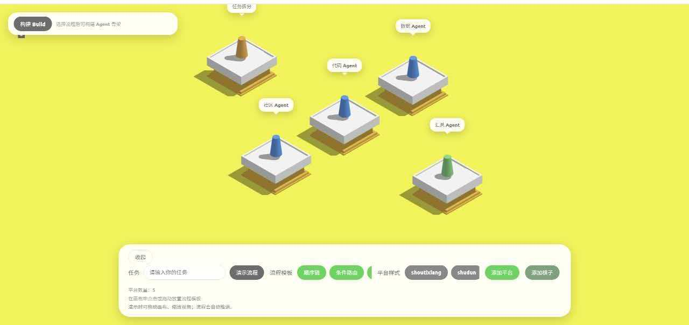
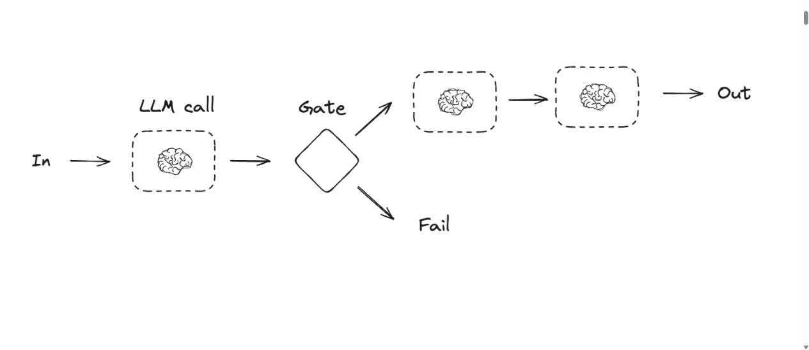
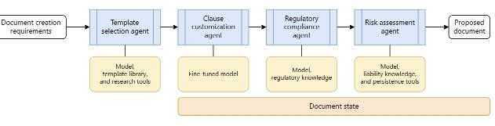

# Agent

## 项目简介

本项目以**跳一跳**式的交互与呈现，帮助零基础用户在移动端（先以平板为主）**简单、快速地搭建属于自己的 Agent**，把抽象的流程变成可点、可跳跃的步骤，降低上手门槛。

## 构建逻辑

- **`agent_builder/`**：存放 Agent **骨架与模板**（如流程模板、Agent / 项目 / 配置等生成相关代码），作为生成与扩展的基准结构。
- **`back_agent/`**：负责**读懂骨架代码**，结合用户在前端描述的需求，对 Agent 进行**补全、改写与落地**，把「模板」变成符合你目标的实现。



前端核心思想：通过简单的类游戏界面，保留按压跳跃的思想，让用户清晰的理解每个Agent workflow的流程（项目中有7种workflow：1 顺序链 2 路由 3 并行 4 辩论 5 循环 6 层级 7 监督者）。传统的workflow处于平面上的展示：




我们将平面转换成空间，通过跳一跳这个载体能够更加动态的演示整个agent的运行流程。

后端核心思想：**`back_agent`**（源码目录：`C:\Users\86182\Desktop\agent\back_agent`）在 **`agent_builder`**（`C:\Users\86182\Desktop\agent\agent_builder`）产出的 **代码骨架** 之上，结合用户在前端的任务描述进行 **补全、改写与落地**；**`backend`**（`C:\Users\86182\Desktop\agent\backend`）中的编排服务（如 `orchestrator.py`）负责串联：动态加载 `agent_builder` 下的构建脚本生成骨架，再通过本地 HTTP 将「骨架 + 需求」交给 **back_agent**（默认对接 `http://localhost:8000/chat`，需单独启动 **back_agent** 服务，与 `REACT_AGENT_API_URL` 一致）。

**沙盒与工具：** 创建出来的 Agent 在实际执行各类操作（如文件读写、Shell、浏览器自动化等）时，通过 **沙盒** 内暴露的工具完成，而不是直接落在宿主机上。仓库 **`sandbox-main`**（`C:\Users\86182\Desktop\agent\sandbox-main`）提供与 Agent Sandbox 对应的 **工具、SDK 与文档**；本地联调时需按下文 **「沙盒（Docker）」** 启动镜像，并由 **`backend`** 为各 Agent 分配/连接对应沙盒实例。

## 前端

安装依赖：

```bash
cd C:\Users\86182\Desktop\agent\Frontend
npm install
```

启动服务：

```bash
cd C:\Users\86182\Desktop\agent\Frontend
npm run server -- --host 0.0.0.0 --port 6301 --allowed-hosts all
```

服务监听 `0.0.0.0:6301`，局域网内其他设备可通过本机 IP 访问。

查看本机在局域网中的 IP（Windows）：

```bash
ipconfig
```

在输出中找到当前网卡（如「无线局域网适配器 WLAN」或「以太网适配器」）下的 **IPv4 地址**，例如 `192.168.x.x`。

## 后端

安装依赖：

```bash
cd C:\Users\86182\Desktop\agent\backend
python -m pip install "fastapi" "uvicorn[standard]" "pydantic"
```

启动服务：

```bash
cd C:\Users\86182\Desktop\agent\backend
python -m uvicorn orchestrator:app --host 0.0.0.0 --port 8001
```

## 沙盒（Docker）

```bash
docker run --security-opt seccomp=unconfined --rm -it -p 8080:8080 ghcr.io/agent-infra/sandbox:latest
```
