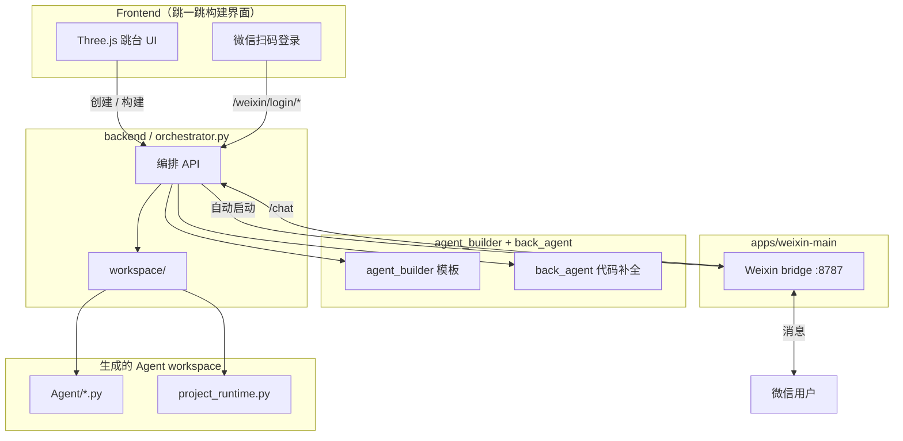

<div align="center">
  
  <h1>Jumping-Agent</h1>
  <p><strong>通过游戏方式，将平面智能体构建改为空间化智能体构建，让小白轻松上手</strong></p>
  <p>
    <a href="README_EN.md">English</a> |
    <a href="README.md">中文</a>
  </p>
</div>

## 项目简介

这是一个非常有趣的项目，以**跳一跳游戏**式的交互与呈现，帮助零基础用户在移动端（先以平板为主）**简单、快速地搭建属于自己的 Agent**，把抽象的流程变成可点、可跳跃的步骤，极大降低上手门槛。

本项目把传统平面 workflow 转换为空间化、游戏化流程，通过跳一跳这个载体更动态地演示 Agent 的运行过程。

在这里，你看不到错综复杂的连线与箭头；只需按压屏幕、操控棋子一次次跳跃，就能直观地体会 Agent 工作流是如何一环接一环向前推进的。


### 介绍视频

https://github.com/answeryt/Jumping-Agent-platform/raw/main/a4a2f419a19ab877cc3acc61324c3d3b.mp4

## 微信接入

Jumping Agent 现已支持**微信**作为正式接入渠道。在前端完成 Agent 构建后，可通过扫码绑定微信账号，直接在微信中与你的 Agent 对话。

**使用流程**

1. 在跳一跳式前端中构建并完成 Agent。
2. 切换到 **微信** 标签页，发起扫码登录。
3. 使用微信扫描二维码完成账号绑定。
4. 在微信中发送消息 — 连接器会将消息转发至编排服务，运行对应 Agent workspace，并将回复发回微信。

**相关模块**

- **`Frontend/`** — 微信标签页、二维码展示与登录状态轮询。
- **`backend/orchestrator.py`** — 微信相关 API，以及 Weixin bridge 的自动启动。
- **`apps/weixin-main/`** — 微信 iLink 连接器（扫码登录、账号存储、长轮询、文本/媒体消息）。

默认服务地址：

- Frontend: `http://localhost:6301`
- back_agent: `http://localhost:8000/chat`
- backend / Orchestrator: `http://localhost:8001`
- Weixin bridge: `http://localhost:8787`

## 项目结构

```text
Jumping-Agent/
├── Frontend/                 # 跳一跳式 Agent 构建界面（Three.js）
│   ├── js/game/              # 游戏逻辑、流程模板、构建客户端
│   ├── css/                  # 样式
│   └── res/                  # 3D 模型与图标
├── agent_builder/            # Agent 骨架与模板
│   ├── flow_template/        # 流程模板（顺序、路由、并行等）
│   ├── agent_template/       # Agent 类模板
│   ├── project_template/       # 项目脚手架
│   └── config_creator/       # 配置生成
├── back_agent/               # 用于代码补全与改写的 ReAct Agent
│   ├── agent/                # ReAct 核心
│   ├── workflow/             # Agent 工作流执行
│   ├── tools/                # 本地代码工具（读/写/运行项目）
│   └── skill/                # 单/多 Agent 构建技能提示词
├── backend/                  # 编排与运行时服务
│   ├── orchestrator.py       # 主 API：构建、聊天、微信桥接
│   ├── workspace/            # 生成的 Agent 项目工作区
│   ├── tools/                # 后端 MCP 工具（网页、图像、会话等）
│   ├── memory/               # 会话与长期记忆
│   └── agent_manager/        # Agent ID 管理
├── apps/
│   └── weixin-main/          # 微信 iLink 连接器
│       └── src/bridge/       # 与 orchestrator 通信的桥接服务
├── tools/                    # 共享 TypeScript 工具实现
└── assets/                   # 产品 Logo
```



## 架构说明

- **`Frontend/`**：跳一跳式 Agent 构建界面，负责 workflow 展示、节点配置、聊天入口，以及微信扫码绑定。
- **`agent_builder/`**：Agent 骨架与模板，包括流程模板、Agent 模板、项目模板和配置生成逻辑。
- **`back_agent/`**：读取骨架代码，并结合用户在前端输入的需求，对 Agent 进行补全、改写与落地。
- **`backend/`**：编排服务。`orchestrator.py` 负责串联前端请求、动态加载 `agent_builder`、生成 Agent workspace、通过本地 HTTP 调用 `back_agent`，并提供微信接入 API。
- **`apps/weixin-main/`**：微信 iLink 连接器，提供扫码登录、账号持久化、消息轮询与回复/媒体发送能力。

## Quick Start

### Prerequisites

- Git
- Python 3.11+
- Node.js 18+
- npm

### Clone

```bash
git clone https://github.com/answeryt/Jumping-Agent-platform.git
cd Jumping-Agent-platform
```

### Install Frontend Dependencies

```bash
cd Frontend
npm install
cd ..
```

### Install Backend Dependencies

建议先创建虚拟环境：

```bash
python -m venv .venv
```

Windows:

```bash
.venv\Scripts\activate
```

macOS / Linux:

```bash
source .venv/bin/activate
```

安装 Python 依赖：

```bash
python -m pip install "fastapi" "uvicorn[standard]" "pydantic" "openai"
```

安装微信连接器依赖：

```bash
cd apps/weixin-main
npm install
cd ../..
```

### Configure API Key

`back_agent/config/model_config.toml` 默认读取 `OPENAI_API_KEY` 环境变量。你可以直接设置环境变量，也可以使用项目内置脚本写入 `.env`。

方式一：使用环境变量。

Windows PowerShell:

```powershell
$env:OPENAI_API_KEY="your_api_key_here"
```

macOS / Linux:

```bash
export OPENAI_API_KEY="your_api_key_here"
```

方式二：使用项目脚本。

```bash
python backend/set_agent_api_key.py
```

脚本会要求你输入 API Key，并更新 `back_agent/.env` 以及已生成 workspace 的 `.env`。

### Start Services

需要打开 3 个终端，并都在仓库根目录下执行。

终端 A：启动 `back_agent`。

```bash
cd back_agent
python -m uvicorn api:app --host 0.0.0.0 --port 8000
```

终端 B：启动 `backend` / Orchestrator（默认会自动启动 Weixin bridge）。

```bash
cd backend
python -m uvicorn orchestrator:app --host 0.0.0.0 --port 8001
```

终端 C：启动前端。

```bash
cd Frontend
npm run server -- --host 0.0.0.0 --port 6301 --allowed-hosts all
```

打开浏览器访问：

```text
http://localhost:6301
```

### 接入微信

1. 在前端构建 Agent，并等待构建完成。
2. 切换到 **微信** 标签页。
3. 点击获取二维码，使用微信扫码。
4. 绑定成功后，在微信中向该账号发送消息即可与 Agent 对话。

## iPad / 局域网访问

如果希望在 iPad 上访问前端，需要确保 iPad 和电脑处于同一局域网，并使用电脑的局域网 IP 访问。

Windows 查看 IP：

```powershell
ipconfig
```

macOS / Linux 查看 IP：

```bash
ifconfig
```

找到当前网卡的 IPv4 地址，例如 `192.168.x.x`，然后在 iPad 浏览器中访问：

```text
http://192.168.x.x:6301
```

## CLI 计划

当前仓库可以通过上面的源码命令运行。为了让 GitHub 用户更容易上手，推荐后续把这些步骤封装成 CLI，例如：

```bash
agent-jump setup
agent-jump config set OPENAI_API_KEY
agent-jump dev
```

理想情况下：

- `agent-jump setup` 安装前端和后端依赖。
- `agent-jump config set OPENAI_API_KEY` 写入模型 API Key。
- `agent-jump dev` 同时启动 back_agent、backend（含 Weixin bridge）和 Frontend。

在 CLI 正式实现前，请使用 `Quick Start` 中的手动启动方式。

## 致谢与说明

本项目由我个人独立开发。受限于个人精力和能力，当前版本仍有不少不足，例如：Agent Workflow 目前仅提供 7 种模板、跳台编排与最终构建流程尚不够稳定等。我会持续迭代完善。

若您愿意一起把项目做得更好，欢迎提交 Issue 或 PR。或者您可以直接联系我：answeryt@qq.com。中国朋友可以通过微信联系我：`answerYTAarun`

也期待更多小白能用它发挥想象力，搭建属于自己的 Agent。
