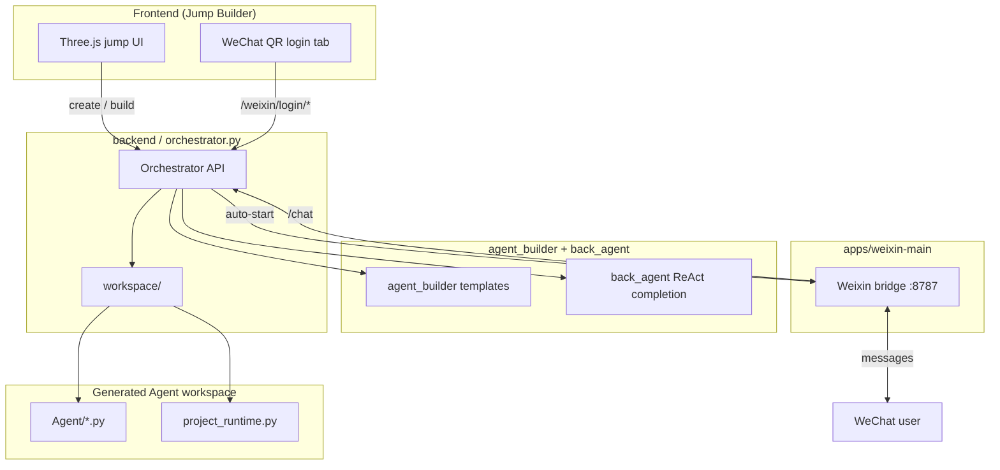

<div align="center">
  
  <h1>Jumping-Agent</h1>
  <p><strong>Turn flat Agent building into spatial Agent building through gameplay—easy for beginners to get started</strong></p>
  <p>
    <a href="README_EN.md">English</a> |
    <a href="README.md">中文</a>
  </p>
</div>

## Project Overview

Jumping Agent is a fun and approachable project that uses a "jumping game" style interaction to help beginners build their own Agents on mobile devices, especially tablets. It turns abstract Agent workflows into visible, touchable, step-by-step jumps, making the whole process easier to understand and use.

Instead of showing users a flat workflow full of complex lines and arrows, this project presents the workflow in a spatial and game-like way. By pressing the screen and controlling a character to jump forward, users can intuitively understand how an Agent workflow moves from one step to the next.


### Intro Video

https://github.com/answeryt/Jumping-Agent-platform/raw/main/a4a2f419a19ab877cc3acc61324c3d3b.mp4

## WeChat Integration

Jumping Agent now supports **WeChat** as a live channel. After you build an Agent in the frontend, you can scan a QR code to bind your WeChat account and chat with that Agent directly in WeChat.

**How it works**

1. Build and complete an Agent in the jumping-style frontend.
2. Open the **WeChat** tab in the UI and start QR login.
3. Scan the QR code with WeChat to bind the account.
4. Send messages in WeChat — the connector forwards them to the orchestrator, runs the selected Agent workspace, and replies in WeChat.

**Related components**

- **`Frontend/`** — WeChat tab, QR display, and login status polling.
- **`backend/orchestrator.py`** — WeChat API endpoints and optional auto-start of the bridge process.
- **`apps/weixin-main/`** — Weixin iLink connector (QR login, account storage, long polling, text/media messaging).

Default service URLs:

- Frontend: `http://localhost:6301`
- back_agent: `http://localhost:8000/chat`
- backend / Orchestrator: `http://localhost:8001`
- Weixin bridge: `http://localhost:8787`

## Project Structure

```text
Jumping-Agent/
├── Frontend/                 # Jump-game Agent builder UI (Three.js)
│   ├── js/game/              # Game logic, workflow templates, build client
│   ├── css/                  # Styles
│   └── res/                  # 3D models and icons
├── agent_builder/            # Agent skeletons and templates
│   ├── flow_template/        # Workflow templates (sequential, router, parallel, …)
│   ├── agent_template/       # Agent class templates
│   ├── project_template/     # Project scaffolding
│   └── config_creator/       # Config generation
├── back_agent/               # ReAct agent for code completion and modification
│   ├── agent/                # ReAct agent core
│   ├── workflow/             # Agent workflow execution
│   ├── tools/                # Local code tools (read/write/run project)
│   └── skill/                # Skill prompts for single/multi-agent builds
├── backend/                  # Orchestration and runtime services
│   ├── orchestrator.py       # Main API: build, chat, WeChat bridge
│   ├── workspace/            # Generated Agent project workspaces
│   ├── tools/                # Backend MCP tools (web, image, sessions, …)
│   ├── memory/               # Session and long-term memory
│   └── agent_manager/        # Agent ID management
├── apps/
│   └── weixin-main/          # WeChat iLink connector
│       └── src/bridge/       # Bridge server that talks to orchestrator
├── tools/                    # Shared TypeScript tool implementations
└── assets/                   # Product logo
```



## Architecture

- **`Frontend/`**: The jumping-style Agent building interface. It handles workflow display, node configuration, chat entry, and WeChat QR binding.
- **`agent_builder/`**: Agent skeletons and templates, including workflow templates, Agent templates, project templates, and configuration generation logic.
- **`back_agent/`**: Reads skeleton code and uses the user's frontend input to complete, modify, and generate the Agent implementation.
- **`backend/`**: The orchestration service. `orchestrator.py` connects frontend requests, dynamically loads `agent_builder`, generates Agent workspaces, calls `back_agent` through local HTTP requests, and exposes WeChat integration APIs.
- **`apps/weixin-main/`**: Weixin iLink connector for QR login, account persistence, inbound message polling, and outbound replies/media.

## Quick Start

### Prerequisites

- Git
- Python 3.11+
- Node.js 18+
- npm

### Clone

```bash
git clone https://github.com/answeryt/Jumping-Agent-platform.git
cd Jumping-Agent-platform
```

### Install Frontend Dependencies

```bash
cd Frontend
npm install
cd ..
```

### Install Backend Dependencies

It is recommended to create a virtual environment first:

```bash
python -m venv .venv
```

Windows:

```bash
.venv\Scripts\activate
```

macOS / Linux:

```bash
source .venv/bin/activate
```

Install Python dependencies:

```bash
python -m pip install "fastapi" "uvicorn[standard]" "pydantic" "openai"
```

Install Weixin bridge dependencies:

```bash
cd apps/weixin-main
npm install
cd ../..
```

### Configure API Key

`back_agent/config/model_config.toml` reads the `OPENAI_API_KEY` environment variable by default. You can set the environment variable directly, or use the built-in project script to write it into `.env`.

Option 1: use an environment variable.

Windows PowerShell:

```powershell
$env:OPENAI_API_KEY="your_api_key_here"
```

macOS / Linux:

```bash
export OPENAI_API_KEY="your_api_key_here"
```

Option 2: use the project script.

```bash
python backend/set_agent_api_key.py
```

The script will ask for your API key and update `back_agent/.env` as well as the `.env` files in generated workspaces.

### Start Services

Open 3 terminals and run each command from the repository root.

Terminal A: start `back_agent`.

```bash
cd back_agent
python -m uvicorn api:app --host 0.0.0.0 --port 8000
```

Terminal B: start `backend` / Orchestrator (Weixin bridge auto-starts by default).

```bash
cd backend
python -m uvicorn orchestrator:app --host 0.0.0.0 --port 8001
```

Terminal C: start the frontend.

```bash
cd Frontend
npm run server -- --host 0.0.0.0 --port 6301 --allowed-hosts all
```

Open the browser and visit:

```text
http://localhost:6301
```

### Connect WeChat

1. Build an Agent in the frontend and wait for the build to finish.
2. Switch to the **WeChat** tab.
3. Click to request a QR code, then scan it with WeChat.
4. After binding succeeds, send a message to the bound account in WeChat to talk to your Agent.

## iPad / LAN Access

If you want to access the frontend from an iPad, make sure the iPad and your computer are on the same local network, then visit the computer's LAN IP address.

Check the IP address on Windows:

```powershell
ipconfig
```

Check the IP address on macOS / Linux:

```bash
ifconfig
```

Find the IPv4 address of your current network adapter, for example `192.168.x.x`, then open this address in the iPad browser:

```text
http://192.168.x.x:6301
```

## CLI Plan

The repository can currently be run with the manual source commands above. To make it easier for GitHub users to get started, a CLI could later wrap these steps, for example:

```bash
agent-jump setup
agent-jump config set OPENAI_API_KEY
agent-jump dev
```

Ideally:

- `agent-jump setup` installs frontend and backend dependencies.
- `agent-jump config set OPENAI_API_KEY` writes the model API key.
- `agent-jump dev` starts back_agent, backend (with Weixin bridge), and Frontend together.

Before the CLI is officially implemented, please use the manual startup steps in `Quick Start`.

## Acknowledgements

This project was independently developed by me. Due to limited personal time and experience, the current version still has some limitations. For example, the Agent workflow currently provides only 7 templates, and the jump-platform orchestration plus final build process are not yet fully stable. I will continue improving the project.

If you would like to help make this project better, issues and pull requests are welcome. You can also contact me directly at [answeryt@qq.com](mailto:answeryt@qq.com). Chinese users may contact me on WeChat: `answerYTAarun`.

I also hope more beginners can use it to explore their imagination and build their own Agents.
